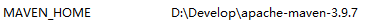
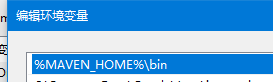
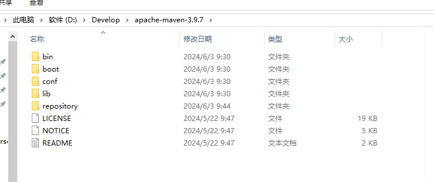

# maven

下载安装包maven 3.9.7

配置环境变量

改变conf/setting.xml 内容

<localRepository>D:\Develop\apache-maven-3.9.7\repository</localRepository>

<mirror>
            <id>alimaven</id>
            <name>aliyun maven</name>
            <url>https://maven.aliyun.com/repository/central</url>
            <mirrorOf>central</mirrorOf>
        </mirror>

在maven文件夹下创建repository文件夹

去idea改maven配置

# mysql

安装mysql installer8.0

双击按步骤操作 密码root

系统环境配置path添加 C:\Program Files\MySQL\MySQL Server 8.0\bin

