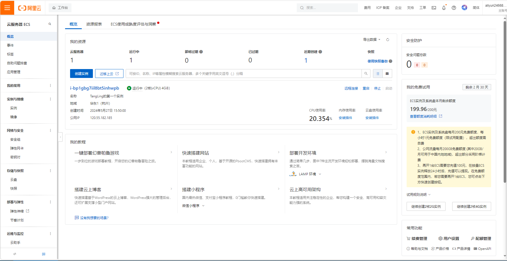
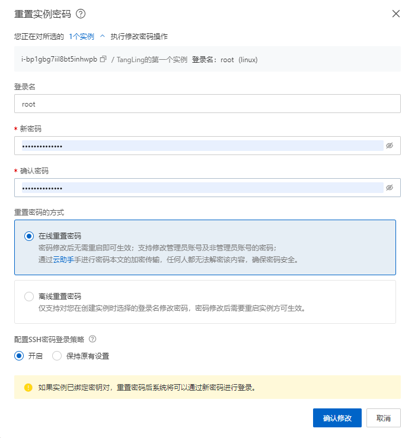
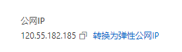
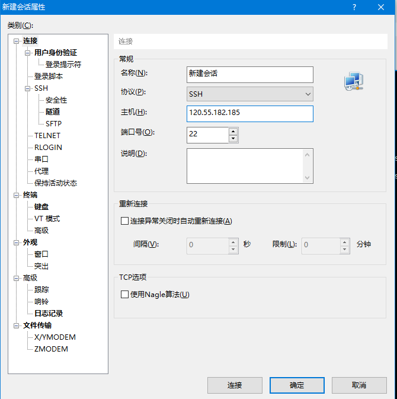
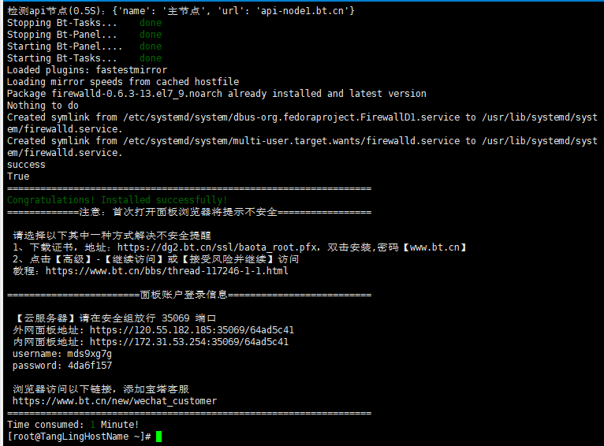
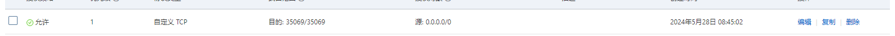

# 云服务器搭建

背景：阿里云0元白嫖3个月，趁这个机会学习一下服务器的使用



## 搭建过程

### 1.修改密码



### 2.下载xshell6

需要破解，破解方法网上有

先找到阿里云上的公网ip



作为主机名，在xshell上新建会话



### 3.安装宝塔面板

cv下面的命令到xshell中

下面是宝塔面板的安装命令：
针对CentOS系统的安装命令：

yum install -y wget && wget -O install.sh http://download.bt.cn/install/install_6.0.sh && sh install.sh
针对Ubuntu系统的安装命令：

wget -O install.sh http://download.bt.cn/install/install-ubuntu_6.0.sh && sudo bash install.sh
针对Debian系统的安装命令：

wget -O install.sh http://download.bt.cn/install/install-ubuntu_6.0.sh && bash install.sh
针对Fedora系统的安装命令：

wget -O install.sh http://download.bt.cn/install/install_6.0.sh && bash install.sh


安装完成！



记得在安全组中配置一下，使得可以访问35069端口



```
 【云服务器】请在安全组放行 35069 端口
 外网面板地址: https://120.55.182.185:35069/64ad5c41
 内网面板地址: https://172.31.53.254:35069/64ad5c41
 username: mds9xg7g
 password: 569db868
```

进入宝塔面板


[HDOJ|落絮飞雁 (luoxufeiyan.com)](https://www.luoxufeiyan.com/category/code/hdoj/)

不要看传播焦虑的文章和话（吸引力法则），过好当下，去澳洲好好学，感受当地，找实习（国内的或者当地的）毕业（读博；上班；去德国读博），攒够钱去欧洲

[Snowy: 最新：💖国内首个国密前后分离快速开发平台💖，采用Vue3+AntDesignVue4+Vite5+SpringBoot3+Mp+HuTool+SaToken。集成国密加解密插件，在前后分离框架中，实现前后分离“密”不可分；同时实现国产化机型、中间件、数据库适配，是您的不二之选；最后官网提供工作流、多租户、多数据源、Vue3表单设计器等丰富插件灵活使用。 (gitee.com)](https://gitee.com/xiaonuobase/snowy)

