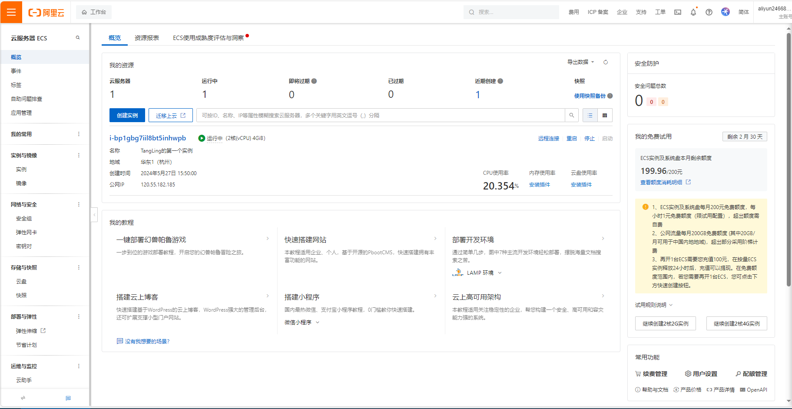

# 云服务器搭建

背景：阿里云0元白嫖3个月，趁这个机会学习一下服务器的使用



## 搭建过程

### 1.修改密码


### 2.下载xshell6

需要破解，破解方法网上有

先找到阿里云上的公网ip


作为主机名，在xshell上新建会话


### 3.安装宝塔面板

cv下面的命令到xshell中

下面是宝塔面板的安装命令：
针对CentOS系统的安装命令：

yum install -y wget && wget -O install.sh http://download.bt.cn/install/install_6.0.sh && sh install.sh
针对Ubuntu系统的安装命令：

wget -O install.sh http://download.bt.cn/install/install-ubuntu_6.0.sh && sudo bash install.sh
针对Debian系统的安装命令：

wget -O install.sh http://download.bt.cn/install/install-ubuntu_6.0.sh && bash install.sh
针对Fedora系统的安装命令：

wget -O install.sh http://download.bt.cn/install/install_6.0.sh && bash install.sh


安装完成！


记得在安全组中配置一下，使得可以访问35069端口


```
 【云服务器】请在安全组放行 35069 端口
 外网面板地址: https://120.55.182.185:35069/64ad5c41
 内网面板地址: https://172.31.53.254:35069/64ad5c41
 username: mds9xg7g
 password: 569db868
```

进入宝塔面板