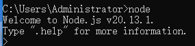
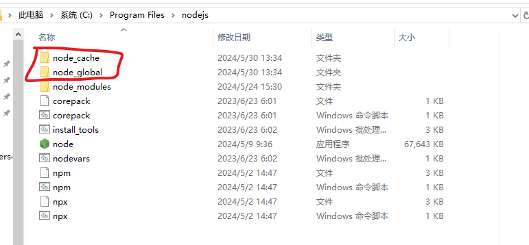
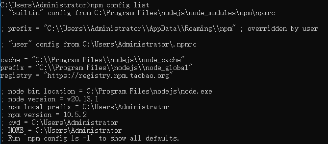

## node.js安装配置

安装完成，不过多赘述



**安装淘宝镜像源**

npm config set registry https://registry.npmmirror.com

**环境配置**

安装目录下新建“node_global”和 “node_cache” 文件夹



``npm config set prefix "C:\Program Files\nodejs\node_global" //设置全局安装包的目录路径
npm config set cache "C:\Program Files\nodejs\node_cache" //设置 npm 包的缓存路径``

npm config list查看是否成功




环境变量path添加C:\Program Files\nodejs\node_global

## 安装Vue

`npm install -g @vue/cli`

检验是否安装成功：

```bash
npm list vue -g 
```

**安装webpack：js打包工具**

```
npm install -g webpack
```

**安装 vue-router**

npm install -g vue-router

## 创建vue项目

npm i -g @vue/cli-init

vue create xx 失败，提示vue无法加载文件D:\Program Files\nodejs\node_global\vue.ps1,因为在此系统上禁止运行脚本

解决：执行get-ExecutionPolicy，如果回复Restricted，表示状态是禁止的，执行set-ExecutionPolicy RemoteSigned，选y，成功！