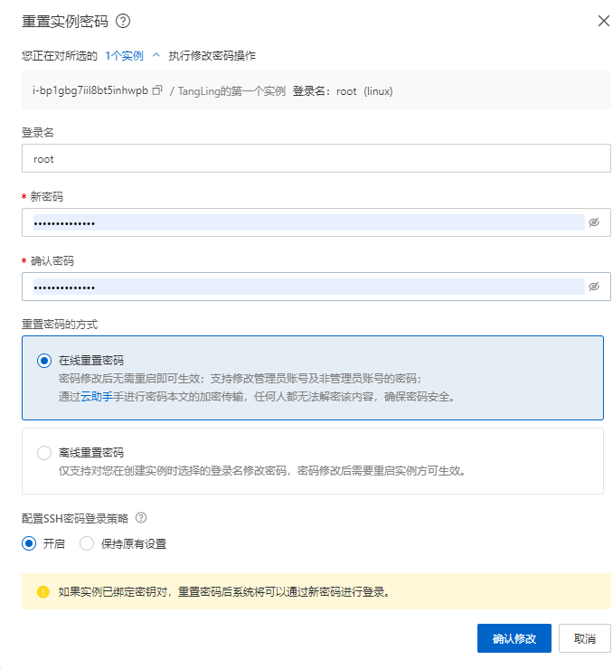
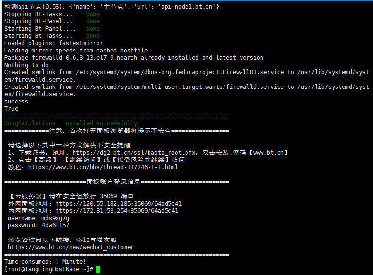
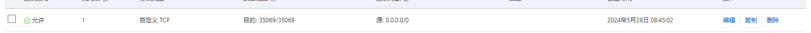

# 云服务器搭建

背景：阿里云0元白嫖3个月，趁这个机会学习一下服务器的使用


## 搭建过程

### 1.修改密码



### 2.下载xshell6

需要破解，破解方法网上有

先找到阿里云上的公网ip


作为主机名，在xshell上新建会话


### 3.安装宝塔面板

cv下面的命令到xshell中

下面是宝塔面板的安装命令：
针对CentOS系统的安装命令：

yum install -y wget && wget -O install.sh http://download.bt.cn/install/install_6.0.sh && sh install.sh
针对Ubuntu系统的安装命令：

wget -O install.sh http://download.bt.cn/install/install-ubuntu_6.0.sh && sudo bash install.sh
针对Debian系统的安装命令：

wget -O install.sh http://download.bt.cn/install/install-ubuntu_6.0.sh && bash install.sh
针对Fedora系统的安装命令：

wget -O install.sh http://download.bt.cn/install/install_6.0.sh && bash install.sh


安装完成！



记得在安全组中配置一下，使得可以访问35069端口



```
 【云服务器】请在安全组放行 35069 端口
 外网面板地址: https://120.55.182.185:35069/64ad5c41
 内网面板地址: https://172.31.53.254:35069/64ad5c41
 username: mds9xg7g
 password: 569db868
```

进入宝塔面板


# 服务器部署过程

## docker

https://help.aliyun.com/zh/ecs/use-cases/install-and-use-docker-on-a-linux-ecs-instance

---

## ftp

#### 搭建pure-ftp 连接https://www.linuxidc.com/Linux/2017-11/148518.htm  https://blog.csdn.net/weixin_49512850/article/details/120566426

一直启动不了，发现是端口占用的原因https://blog.csdn.net/qq_41328797/article/details/119921657

ftp 两种模式：

- 主动模式：客户端给服务端21端口发送命令说我已经打开了我的20端口，服务器知道后发起连接

- 被动模式：客户端发送命令，服务端打开端口。客户端发起连接

### ftp配置

/etc/vsftpd.conf 添加以下命令

userlist_deny=NO
userlist_enable=YES
userlist_file=/etc/allowed_users
seccomp_sandbox=NO
local_root=/home/userftp/
local_enable=YES
write_enable=YES

systemctl restart vsftpd 重启

### ftp给文件传输权限

https://blog.csdn.net/your_flavor/article/details/118611412

突然ftp连接不了，更改ftpuer密码

passwd  ftpuser  

---

## lnmp环境

#### 远程连接数据库权限问题

https://blog.csdn.net/mazaiting/article/details/106661158

https://blog.csdn.net/qq_42774234/article/details/124337976

-----

## Httpd

https://www.cnblogs.com/snake553/p/8856729.html

#### 同时部署多个项目

首先打开Apache的[配置文件](https://www.zhihu.com/search?q=配置文件&search_source=Entity&hybrid_search_source=Entity&hybrid_search_extra={"sourceType"%3A"answer"%2C"sourceId"%3A904524754})httpd.conf吧[端口监听](https://www.zhihu.com/search?q=端口监听&search_source=Entity&hybrid_search_source=Entity&hybrid_search_extra={"sourceType"%3A"answer"%2C"sourceId"%3A904524754})修改成

Listen 80

Listen 8080

Listen 8081

然后再设置虚拟主机指向的目录配置

NameVirtualHost *:80

<VirtualHost *:80>

ServerName localhost

DocumentRoot “\www\home″

</VirtualHost>


NameVirtualHost *:8080

<VirtualHost *:8080>

ServerName localhost:8080

DocumentRoot “\www\tomcat″

</VirtualHost>


NameVirtualHost *:8081

<VirtualHost *:8081>

ServerName localhost:8081

DocumentRoot “\root\myblog″

</VirtualHost>


最后，重启Apache，就可以用

localhost

localhost:8080

localhost:8081

访问到你不同的几个网站了


## ruoyi

### 遇到的无法启动问题

https://blog.csdn.net/qq_41897021/article/details/121730514

#### 

Clone ruoyi-vue 

admin的yml文件里的mysql配置，redis配置，ser]ver--8085

maven package成jar包（记得先install全部）

#### ruoyi前端

1. npm install

2. npm run build:prod打包到dist

   

# linux知识

～表示当前用户的主目录

/表示根目录

./表示当前目录

../表示上一级目录

linux文件结构

​	bin放了常用命令

​	boot放核心文件，包括连接和镜像

​	root 重点

​	...

解压命令：tar -xzvf 

